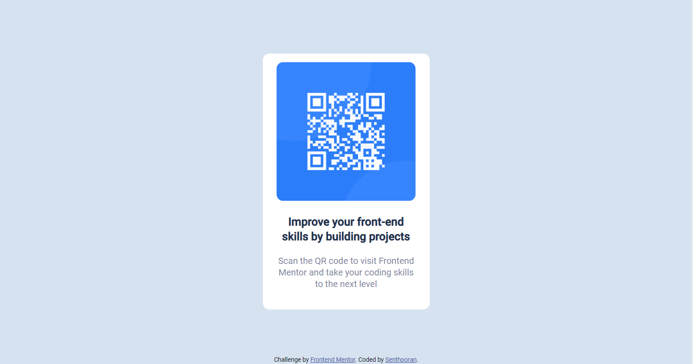

# Frontend Mentor - QR code component solution

This is a solution to the [QR code component challenge on Frontend Mentor](https://www.frontendmentor.io/challenges/qr-code-component-iux_sIO_H). Frontend Mentor challenges help you improve your coding skills by building realistic projects. 

## Table of contents

- [Overview](#overview)
  - [Screenshot](#screenshot)
  - [Links](#links)
- [My process](#my-process)
  - [Built with](#built-with)
  - [What I learned](#what-i-learned)
  - [Continued development](#continued-development)
  - [Useful resources](#useful-resources)
- [Author](#author)
- [Acknowledgments](#acknowledgments)


## Overview

### Screenshot



### Links

- Solution URL: [Repo](https://github.com/insertQuirkyNameHere/css-challenges/tree/main/Challenge%201)
- Live Site URL: [Live](https://your-live-site-url.com)

## My process

### Built with

- HTML
- CSS
- CSS Flexbox

### What I learned

- Allowed me to revisit CSS basics
- Revisited reset CSS
- Worked with images
- Allowed me a chance to work with the position property again

**Here is how to vertically center a div**


```css
.verically-centered-div{
    position: absolute;
    top: 50%;
    -ms-transform: translateY(-50%);
    transform: translateY(-50%);
}
```

### Continued development

- I want to continue practicing CSS flexbox and experimenting with CSS positions till I am fully comfortable with them.
- Am currently working on React and would love to revisit this and code it out using React components

### Useful resources

- [CSS Tricks Flexbox Guide](https://css-tricks.com/snippets/css/a-guide-to-flexbox/) - My goto reference for CSS flex. Concepts are clearly explained with neat examples and diagrams that aid comprehension.

## Author

- Frontend Mentor - [@insertQuirkyNameHere](https://www.frontendmentor.io/profile/insertQuirkyNameHere)
- Twitter - [@b_senthooran](https://twitter.com/b_senthooran)

## Acknowledgments

Will revisit this section soon

