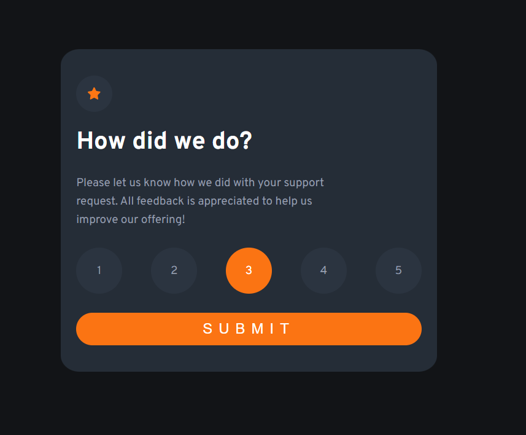
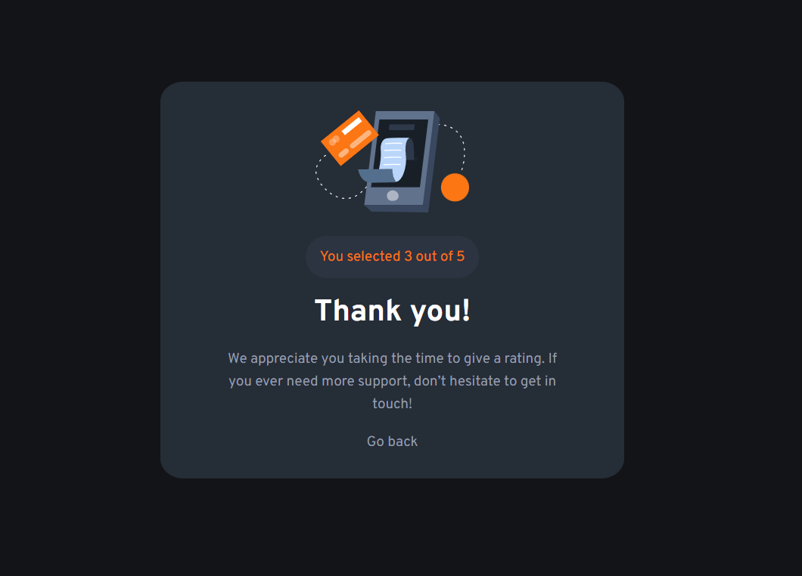

# Frontend Mentor - Interactive rating component solution

This is a solution to the [Interactive rating component challenge on Frontend Mentor](https://www.frontendmentor.io/challenges/interactive-rating-component-koxpeBUmI). Frontend Mentor challenges help you improve your coding skills by building realistic projects. 

## Table of contents

- [Overview](#overview)
  - [The challenge](#the-challenge)
  - [Screenshot](#screenshot)
  - [Links](#links)
- [My process](#my-process)
  - [Built with](#built-with)
  - [What I learned](#what-i-learned)
  - [Useful resources](#useful-resources)
- [Author](#author)
- [Acknowledgments](#acknowledgments)

## Overview

### The challenge

Users should be able to:

- View the optimal layout for the app depending on their device's screen size
- See hover states for all interactive elements on the page
- Select and submit a number rating
- See the "Thank you" card state after submitting a rating

### Screenshot




### Links

- Solution URL: [Repo](https://github.com/insertQuirkyNameHere/css-challenges/blob/main/Challenge2/)
- Live Site URL: [Live](https://sens-css-challenges.netlify.app/challenge2/)

## My process

### Built with
- Semantic HTML5 markup
- CSS custom properties
- Javascript Events
- Flexbox
- Mobile-first workflow


### What I learned

- Styling radio buttons
  - The trick is to hide the `<input>` tags themselves and style the `<label>` tags.
  - Can use a combination of CSS pseudo classes along with the '+' Selector to achieve it.
- Covered align-self property of CSS Flexbox
- Events
- Difference between querySelector() and querySelectorAll()
  - querySelector() only return the first match
  - querySelectorAll() returns all the elements that match the given selector
- innerHTML vs textContent vs createTextNode()

**Here's how to style the radio buttons**
```css
.rating-container > input[type="radio"] + label{
  /* Styles go here */
}
```

```css
.rating-container > input[type="radio"]:hover + label{
  /* Styles go here */
}
```

```css
.rating-container > input[type="radio"]:checked + label{
  /* Styles go here */
}
```
**Here's how to select all checked radio buttons in JS**
```js
const radio = document.querySelector('input[type="radio"]:checked');
//may also use querySelectorAll() depending on the use case.
```

### Useful resources

- [MDN Events Reference](https://developer.mozilla.org/en-US/docs/Web/Events) - Extensive list of Events

## Author
- Frontend Mentor - [@insertQuirkyNameHere](https://www.frontendmentor.io/profile/insertQuirkyNameHere)
- Twitter - [@b_senthooran](https://twitter.com/b_senthooran)

## Acknowledgments

Shoutout to [Alex Marshall](https://www.linkedin.com/in/alex-k-marshall83/?originalSubdomain=uk) for helping me out with the radio buttons styling.
