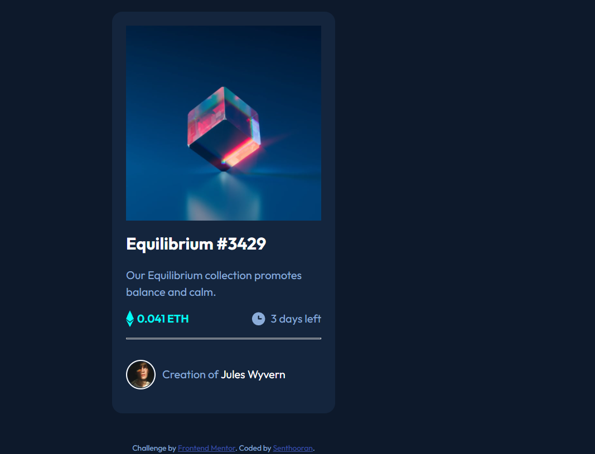

# Frontend Mentor - NFT preview card component solution

This is a solution to the [NFT preview card component challenge on Frontend Mentor](https://www.frontendmentor.io/challenges/nft-preview-card-component-SbdUL_w0U). Frontend Mentor challenges help you improve your coding skills by building realistic projects. 

## Table of contents

- [Overview](#overview)
  - [The challenge](#the-challenge)
  - [Screenshot](#screenshot)
  - [Links](#links)
- [My process](#my-process)
  - [Built with](#built-with)
  - [What I learned](#what-i-learned)
  - [Continued development](#continued-development)
  - [Useful resources](#useful-resources)
- [Author](#author)
- [Acknowledgments](#acknowledgments)

## Overview

### The challenge

Users should be able to:

- View the optimal layout depending on their device's screen size
- See hover states for interactive elements

### Screenshot



### Links

- Solution URL: [Repo](https://github.com/insertQuirkyNameHere/css-challenges/tree/main/Challenge3)
- Live Site URL: [Live](https://sens-css-challenges.netlify.app/challenge3/)

## My process

### Built with

- Semantic HTML5 markup
- CSS custom properties
- Flexbox
- CSS Grid


### What I learned

- How to overlay stuff on an image
- A useful and modern CSS reset


```html
<div class="img-container">
  
  <div class="overlay">
    
  </div>
</div>
```

```css
.img-container{
  position: relative;
}

.overlay {
  display: flex;
  width: 100%;
  height: 100%;
  position: absolute;
  top: 0;
  left: 0;
  opacity: 0;
}

.overlay:hover{
  opacity: 1;

  /*can use trasition to make it smooth like so*/
  transition: opacity 0.2s;
}
```

### Continued development

Hope to continue to work on overlays and the position properties

### Useful resources

- [dcode's](https://www.youtube.com/channel/UCjX0FtIZBBVD3YoCcxnDC4g) [video](https://www.youtube.com/watch?v=exb2ab72Xhs) helped me to understand how to overlay images with text or anything else in a clear and precise manner.
- [Andy's](https://twitter.com/piccalilli_) [blog post](https://piccalil.li/blog/a-modern-css-reset/) on CSS resets in the modern era


## Author

- Frontend Mentor - [@insertQuirkyNameHere](https://www.frontendmentor.io/profile/insertQuirkyNameHere)
- Twitter - [@b_senthooran](https://twitter.com/b_senthooran)


## Acknowledgments
[dcode's](https://www.youtube.com/channel/UCjX0FtIZBBVD3YoCcxnDC4g)Dom for his video on image overlays.


