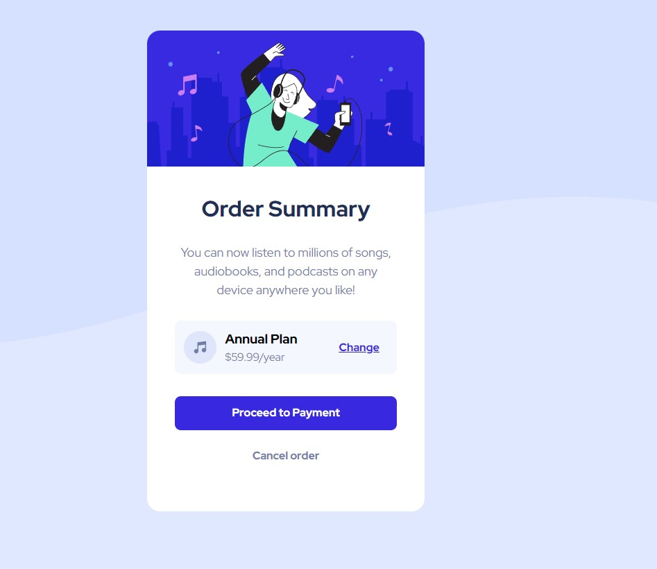

# Frontend Mentor - Order summary card solution

This is a solution to the [Order summary card challenge on Frontend Mentor](https://www.frontendmentor.io/challenges/order-summary-component-QlPmajDUj). Frontend Mentor challenges help you improve your coding skills by building realistic projects. 

## Table of contents

- [Overview](#overview)
  - [The challenge](#the-challenge)
  - [Screenshot](#screenshot)
  - [Links](#links)
- [My process](#my-process)
  - [Built with](#built-with)
  - [What I learned](#what-i-learned)
  - [Continued development](#continued-development)
  - [Useful resources](#useful-resources)
- [Author](#author)
- [Acknowledgments](#acknowledgments)

## Overview

### The challenge

Users should be able to:

- See hover states for interactive elements

### Screenshot

### Links

- Solution URL: [Repo](https://github.com/insertQuirkyNameHere/css-challenges/tree/main/Challenge4)
- Live Site URL: [Live](https://sens-css-challenges.netlify.app/challenge4/)

## My process

### Built with

- Semantic HTML5 markup
- CSS custom properties
- Flexbox

### What I learned

Felt like this was more of a revision challenge. Was mostly straightforward. Worked with the background-image property

### Continued development

I used a desktop first approach. Will maybe try a mobile first approach in future challenges.

### Useful resources

- [W3Schools'](https://www.w3schools.com/cssref/pr_background-image.asp background image reference

## Author

- Frontend Mentor - [@insertQuirkyNameHere](https://www.frontendmentor.io/profile/insertQuirkyNameHere)
- Twitter - [@b_senthooran](https://twitter.com/b_senthooran)

## Acknowledgments

Will revisit soon